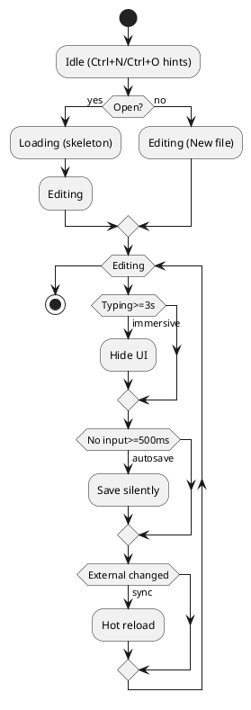
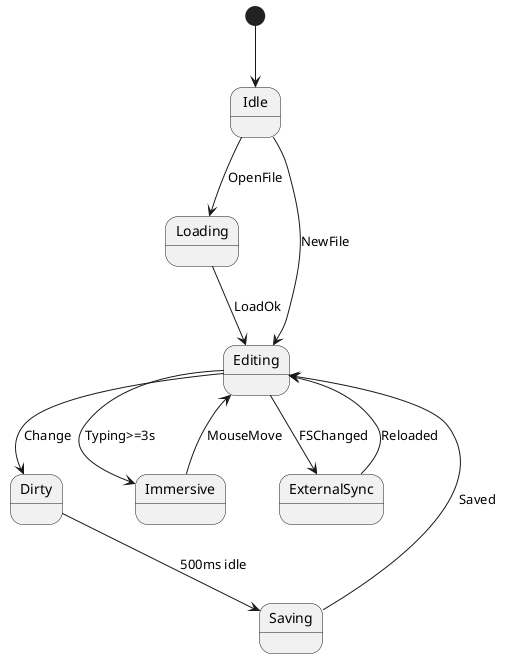
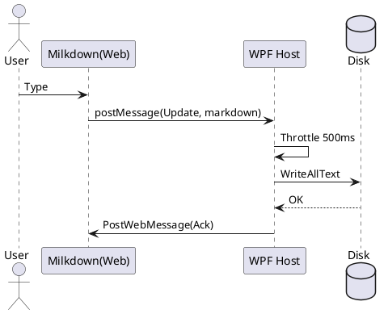

# AuraMark（代号：AuraMark）— 纯粹·沉浸式 Markdown 编辑器  
**文档类型**：PRD + UX Spec + TDD（Detailed Engineering Edition）  
**文档版本**：v1.2（Final Consolidated）  
**负责人**：贺佳  
**更新日期**：2026-03-04  

> 目标：用 **WPF + WebView2 + Milkdown** 复刻 Typora 的“所见即所得”核心体验，并在工程化、性能与沉浸体验上做成可长期迭代的开源底座。

---

## 目录
- [0. 概览](#0-概览)
- [1. PRD 产品需求](#1-prd-产品需求)
- [2. UX 视觉与交互规范](#2-ux-视觉与交互规范)
- [3. TDD 技术设计](#3-tdd-技术设计)
- [4. UML/时序/流程（PlantUML）](#4-uml时序流程plantuml)
- [5. 开源仓库模板与工程化](#5-开源仓库模板与工程化)
- [6. 附录：协议、错误码、测试用例](#6-附录协议错误码测试用例)
- [7. 参考链接](#7-参考链接)

---

## 0. 概览

### 0.1 产品定位
- **一句话**：一款“纯粹、低噪音、沉浸式”的本地 Markdown WYSIWYG 编辑器。
- **平台**：Windows（WPF），渲染与编辑引擎使用 Web 技术（WebView2 + Milkdown）。
- **核心价值**：
  1) **所见即所得**（无分栏预览、写作心流）
  2) **静默保存**（500ms 无输入自动写盘，弱提示不打断）
  3) **沉浸模式**（连续输入≥3s 自动隐藏 UI；鼠标大范围移动唤醒）
  4) **强工程化边界**（宿主与渲染严格隔离，只通过 IPC 同步）

### 0.2 设计约束（必须遵守）
- WPF 与 WebView2 之间 **禁止直接共享复杂对象/状态**，只通过 JSON IPC。
- WebView2 **不能“裸 file://”随意访问本地资源**；必须使用受控映射/拦截策略。
- 任何影响输入手感的 UI 行为（弹窗、强 Toast、抢焦点）都默认禁止。

---

## 1. PRD 产品需求

### 1.1 愿景与非目标
**愿景**：把“写作”本身做成第一等公民——界面越少越好，反馈越轻越好，可靠性越强越好。  

**v1 非目标**：
- 多人实时协同
- 云笔记与账号体系
- 复杂任务管理（留给插件/未来版本）

---

### 1.2 用户画像与场景
| 用户 | 场景 | 关键诉求 |
|---|---|---|
| 开发者/技术写作者 | README、方案文档、技术博客 | 代码块/表格/公式、快捷键、稳定保存 |
| 长文写作者 | 报告、随笔、小说 | 沉浸、长文性能、排版舒适 |
| 知识管理者 | 笔记库维护 | 目录大纲、文件树、多文档切换 |

---

### 1.3 核心交互流与状态机（最终方案）

#### 1.3.1 状态定义
- **Idle**：未加载文件。显示极简提示（`Ctrl+N` 新建，`Ctrl+O` 打开）。侧边栏折叠。
- **Loading**：读取大文件（>5MB）。显示极轻量骨架屏（不阻塞 UI 线程）。
- **Editing**：所见即所得编辑态。
  - **Immersive 子状态**：检测持续键盘输入≥3s → 自动隐藏侧边栏/顶部栏；鼠标大范围移动 → 恢复。
- **Dirty / Saving**：文本变更触发 `●`，500ms 无输入后静默保存，成功后 `●` 消失。
- **ExternalSync**：外部编辑器改动同一文件：暂停前端输入（可选）、读取新内容并热重载（尽量无打断）。

#### 1.3.2 写作心流规则（强约束）
- UI 的出现/消失必须 **渐隐渐现**，不得“跳闪”。
- 保存反馈只能是 **弱提示**（`●` / subtle glow），不得弹窗阻断。
- “外部变更”默认策略：**热重载优先**；仅在冲突风险时提示。

---

### 1.4 功能需求清单

#### 1.4.1 MVP（v1.0 必须）
1) WYSIWYG 编辑（Milkdown + CommonMark）  
2) 打开/新建/保存（含静默保存与失败提示）  
3) 侧边栏：文件树 + 大纲（可折叠）  
4) 沉浸模式自动触发/退出  
5) 外部文件变更热重载  
6) 本地图片显示（受控资源策略）  
7) 快捷键分层（WPF / Web / Milkdown）  

#### 1.4.2 v1.1（增强）
- 大文件体验：骨架屏 + 异步读写 + 渲染阶段提示
- 代码块能力：高亮/字体连字/复制按钮（可选）
- 表格、任务列表、脚注、引用块（插件化扩展）
- 导出：HTML（优先）→ PDF（后续）

#### 1.4.3 v2+（预留）
- 插件系统（本地加载/市场）
- Git 状态展示
- 双向链接/知识图谱（可选）

---

### 1.5 快捷键矩阵（最终）
| 操作 | 快捷键（Windows） | 层级 |
|---|---|---|
| 打开侧边栏 | Ctrl + Shift + L | WPF 拦截 |
| 源码/预览切换（未来 Source Mode） | Ctrl + / | WPF → IPC → Web |
| 插入代码块 | Ctrl + Shift + K | Milkdown |
| 加粗 / 斜体 | Ctrl + B / Ctrl + I | Milkdown |
| 打开文件 | Ctrl + O | WPF |
| 新建文件 | Ctrl + N | WPF |

---

### 1.6 非功能需求（NFR）
- **性能**
  - 5MB 文件：Loading 期间 UI 可交互（骨架屏不阻塞）
  - 输入：正常文本输入无可感卡顿
- **可靠性**
  - 自动保存失败必须可见（轻提示层 + 允许重试）
  - 异常恢复：可选，启动时恢复最近快照
- **安全**
  - WebView2 访问本地资源必须受控（映射/拦截）
  - IPC payload 校验，拒绝未知/超大消息

---

### 1.7 里程碑与验收
| 版本 | 交付 | 验收点 |
|---|---|---|
| v0.1 | 跑通壳子（WPF + WebView2 + Milkdown + IPC） | 编辑→宿主写盘→重启可恢复 |
| v0.2 | UI/UX MVP（沉浸、弱提示、侧边栏） | 3s 沉浸切换；500ms 静默保存点 |
| v0.3 | 外部热重载 + 图片策略 | 外部修改自动更新；本地图片可显示 |
| v1.0 | 可发布 MVP | 安装/启动/打开/编辑/保存稳定 |

---

## 2. UX 视觉与交互规范

### 2.1 设计哲学
- **纯粹**：工具必须“隐身”，只在必要时出现。
- **轻盈**：低对比、低饱和、高通透，减少视觉疲劳。
- **可爱但克制**：日式卡通风是“亲和力”，不是装饰堆砌。

---

### 2.2 精美日式卡通风（Design Tokens）

#### 2.2.1 色彩系统
- Surface：`#F9FAFB`
- Sidebar：`#F3F4F6`
- Primary：`#81A1C1`
- Text：`#434C5E`

建议扩展（工程用）：
- TextMuted：`rgba(67, 76, 94, 0.55)`
- BorderSoft：`rgba(67, 76, 94, 0.10)`
- DangerSoft：`rgba(191, 97, 106, 0.20)`

#### 2.2.2 字体栈
- 中文：`Noto Sans SC`
- 代码：`Fira Code`（强制）
- 正文字号建议：16px
- 行高：正文 1.65～1.8；代码 1.45

#### 2.2.3 圆角与阴影
- 窗体圆角：12px
- 内容卡片：12px
- 图片/代码块：8px
- 阴影（纸张悬浮感）：`0 4px 20px rgba(129, 161, 193, 0.08)`

---

### 2.3 布局与信息层级
- 主编辑区居中：建议宽 760–920px
- 侧边栏默认折叠，唤醒后不抢焦点
- 顶部栏尽量少：文件名/保存状态/极少按钮
- 右下角 SavingDot `●`：存在感极弱

---

### 2.4 动效与反馈
- 动效时长：120–180ms
- 显示/隐藏：用 opacity + translateY(2px) 的轻动画
- 错误提示：轻红背景 + 小范围提示层（不 modal）
- 保存提示：只用 `●` 变化（出现/消失/轻微透明度变化）

---

### 2.5 无边框沉浸式窗口（UX + 工程约束）
- 视觉上无边框，但保留 Windows 原生交互（贴边、阴影、动画）
- 技术上使用 `System.Windows.Shell.WindowChrome`：
  - `CaptionHeight = 0`
  - 顶部 32px 透明拖拽热区（IsHitTestVisibleInChrome）

---

## 3. TDD 技术设计

### 3.1 总体架构：逻辑层与渲染层分离
- WPF（C#）：主逻辑循环、文件 I/O、窗口、状态机、快捷键、外部热重载
- WebView2 + Milkdown：渲染管线（Markdown → DOM → 视觉呈现）
- 同步机制：IPC（JSON）

---

### 3.2 WPF 宿主层详细设计

#### 3.2.1 窗口系统（WindowChrome）
- 使用 WindowChrome 实现无边框但保留系统行为

#### 3.2.2 文件系统守护（FileSystemWatcher）
- 为当前打开文件挂载 FileSystemWatcher
- Changed 触发：
  1) 暂停前端输入（可选：发送 Command FreezeInput）
  2) 读文件新内容
  3) IPC 发 Update/Init 到前端替换内容
  4) 恢复输入

#### 3.2.3 自动保存与节流（Rx.NET 方案）
- Web 侧：不防抖，直接高频发送 Update
- Host 侧：500ms Throttle/Debounce 后写盘
- 写盘成功后：Ack + 隐藏 SavingDot

---

### 3.3 WebView2 承载与资源策略

#### 3.3.1 加载前端：虚拟主机映射
- 将构建产物 `dist/` 拷贝至 `$(OutDir)/EditorView/`
- 使用 `CoreWebView2.SetVirtualHostNameToFolderMapping` 把 EditorView 映射到 `https://app.auramark.local/`
- WebView2 加载 `https://app.auramark.local/index.html`

#### 3.3.2 资源拦截（本地图片与 MIME）
- 对本地图片访问做受控拦截/映射
- 依据文件扩展名返回正确 Content-Type（png/jpg/svg/webp…）

#### 3.3.3 内存与稳定性
- 切换大型文件：`CoreWebView2.Stop()` 后再加载
- 必要时清理浏览数据缓存（可选策略）

---

### 3.4 Milkdown 前端设计

#### 3.4.1 初始化
- preset：commonmark
- theme：可先用 nord，再用自研主题覆盖 tokens

#### 3.4.2 监听与 IPC
- 使用 `@milkdown/plugin-listener` 的 `markdownUpdated`：
  - 每次文档变化 → 获取 markdown → 发送 Update

---

### 3.5 IPC 协议（最终）

#### 3.5.1 Payload（v1）
```json
{
  "type": "Init | Update | Command | Ack | Error",
  "content": "Markdown 或命令参数",
  "timestamp": 0
}
```

#### 3.5.2 Command（建议枚举）
- ToggleSidebar
- ToggleSourceMode（未来）
- FreezeInput / ResumeInput（外部热重载期间）
- ReplaceAll（从宿主把整份 markdown 替换到前端）

#### 3.5.3 Error（建议字段）
- content：错误描述（短）
- meta：错误码、路径、可重试标记（v1.1+）

---

### 3.6 静默保存落地策略（最终）
- 前端：每次 change 发 full markdown（最简单可靠的 MVP）
- 宿主：500ms 无输入触发保存
- 冲突策略：
  - 外部变更到来且本地 Dirty：进入 ExternalSync，提示“外部已变更，是否覆盖/合并？”（v1.1+）
  - MVP 可先选择“外部优先热重载”，并记录本地临时快照用于回滚

---

### 3.7 安全与防护
- IPC 校验：
  - type 必须在白名单
  - content 长度上限（例如 10MB，避免内存炸）
- WebView2：
  - 禁止任意导航到外部域名（可选：NavigationStarting 过滤）
  - 只允许访问 `app.auramark.local` 与受控资源

---

### 3.8 工程化与发布

#### 3.8.1 统一构建入口（MSBuild Target）
- BeforeBuild：`npm install` → `npm run build`
- AfterBuild：拷贝 `dist` → `$(OutDir)/EditorView`

#### 3.8.2 CI（GitHub Actions）
- windows-latest
- build frontend（npm ci + build）
- build solution（dotnet build）

#### 3.8.3 发布（建议）
- .NET 8
- PublishSingleFile（后续）
- WebView2 Runtime：Evergreen

---

## 4. UML/时序/流程（PlantUML）

> 复制到 PlantUML 即可渲染。  

### 4.1 用户流程图（Activity）


### 4.2 状态机（State Machine）


### 4.3 IPC 时序（Sequence）


---

## 5. 开源仓库模板与工程化

### 5.1 仓库结构（最终模板）
```
AuraMark/
  .github/workflows/build.yml
  src/
    AuraMark.sln
    AuraMark.App/   (WPF + WebView2 host)
    AuraMark.Core/  (IPC model)
    AuraMark.Web/   (Vite + Milkdown)
```

### 5.2 启动方式
1) `cd src/AuraMark.Web && npm install && npm run build`
2) VS 打开 `src/AuraMark.sln`，运行 `AuraMark.App`

### 5.3 最小可运行链路（验收）
- WebView2 加载 index.html
- Milkdown 编辑产生 markdownUpdated
- 前端 postMessage(Update)
- 宿主写盘并回 Ack（SavingDot 可见 → 隐藏）
- 重启后仍能读取到已保存内容

---

## 6. 附录：协议、错误码、测试用例

### 6.1 IPC type 白名单（v1）
- Init / Update / Command / Ack / Error

### 6.2 建议错误码（v1.1+）
| Code | 场景 | UI |
|---|---|---|
| E_SAVE_DENIED | 无权限写文件 | 轻提示层 + 引导另存 |
| E_SAVE_IO | IO 异常 | 轻提示层 + 重试 |
| E_IPC_PARSE | JSON 不合法 | 静默记录日志 |
| E_SYNC_CONFLICT | 外部变更冲突 | 提示“选择覆盖/保留” |

### 6.3 核心测试用例（MVP）
1) 新建 → 输入 → 500ms 后保存点消失 → 重启可恢复  
2) 打开 5MB+ 文件：Loading 骨架屏，UI 不冻结  
3) 连续输入≥3s：进入沉浸；鼠标大移动：退出沉浸  
4) 外部编辑器修改同一文件：触发热重载（内容更新）  
5) 拔盘/只读路径：保存失败提示出现，编辑不中断  

---

## 7. 参考链接
- WebView2 WPF 入门（Microsoft Learn）：https://learn.microsoft.com/zh-cn/microsoft-edge/webview2/get-started/wpf  
- SetVirtualHostNameToFolderMapping API（Microsoft Learn）：https://learn.microsoft.com/zh-cn/dotnet/api/microsoft.web.webview2.core.corewebview2.setvirtualhostnametofoldermapping  
- WindowChrome API（Microsoft Learn）：https://learn.microsoft.com/zh-cn/dotnet/api/system.windows.shell.windowchrome  
- FileSystemWatcher.Changed（Microsoft Learn）：https://learn.microsoft.com/zh-cn/dotnet/api/system.io.filesystemwatcher.changed  
- Milkdown listener（markdownUpdated）：https://milkdown.dev/docs/api/plugin-listener
